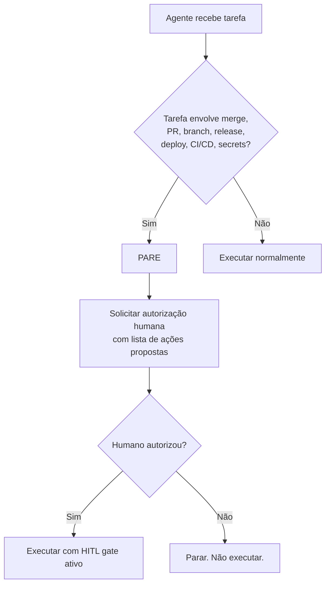

# ⚠️ GUARDRAILS INVOLÁVEIS — HITL Gates

**Todo agente DEVE ler este arquivo antes de qualquer operação de merge, PR, branch, release ou deploy.**

Este é o checkpoint obrigatório. Violar estas regras quebra a confiança do processo. Nunca ignore.

---

## Regra Fundamental

> **NENHUMA operação de merge, push para `main`, release ou deploy pode ser executada sem autorização humana explícita.**
>
> Pare e pergunte. Sempre.

---

## HITL Gates (origem: `.harness/hitl/gates.json` e `.harness/policies/project-policies.md`)

| Gate | Dispara Quando | Autoridade |
|------|---------------|------------|
| **HG-MERGE-FEATURE** | `feat/*` → `develop` ou `fix/*` → `develop` | Lucas de Lima |
| **HG-MERGE-DEVELOP** | `develop` → `main` | Lucas de Lima |
| **HG-RELEASE** | Tag `v*` (release) | Lucas de Lima |
| **HG-DEPLOY** | Publicação na Play Store | Lucas de Lima |
| **HG-PRODUCT** | Mudança de escopo/feature | Lucas de Lima |
| **HG-ARCHITECTURE** | Mudança arquitetural | Lucas de Lima |
| **HG-SCOPE** | Mudança de escopo | Lucas de Lima |
| **HG-MERGE-STORY** | Merge de story/issue | Lucas de Lima |
| **HG-SECURITY-EXCEPTION** | Exceção de segurança | Lucas de Lima |
| **HG-DESTRUCTIVE** | Alterar proteção de branch, CI/CD, secrets, ou infraestrutura crítica | Lucas de Lima |
| **HG-DESTRUCTIVE** | Alterar este arquivo ou remover/reduzir guardrails | Lucas de Lima |

---

## Gatilhos que DEVEM ativar o guardrail

Se a tarefa atual envolver QUALQUER um destes itens, o agente DEVE parar e perguntar ao humano antes de prosseguir:

- `git merge`, `git push` para `main`, `develop` (merge direto)
- `gh pr merge` (qualquer PR)
- `gh pr create`, `gh pr review` com APPROVE
- `gh release create`
- Branch protection rules (API, settings)
- `git tag` + push
- Modificar workflows CI/CD (`.github/workflows/`)
- Modificar secrets, keystore, `google-services.json`
- Publicar ou modificar algo na Play Store
- **Modificar ou remover este arquivo ou o AGENTS.md**

---

## Procedimento Obrigatório

---

## Origem e Autoridade

- Regras detalhadas: `.harness/policies/project-policies.md#HITL`
- Gates config: `.harness/hitl/gates.json`
- Adoption plan: `.harness/adoption-plan.md`

**Este arquivo NÃO substitui os documentos do Harness. Ele é um checkpoint de segurança de superfície para agentes.**

---

*Guardrail instituído em 2026-08-29 após violação de merge sem autorização.*
*Não modificar nem remover sem autorização humana explícita via HG-DESTRUCTIVE.*